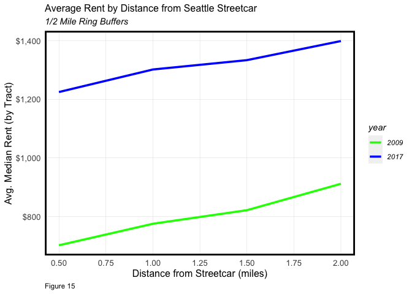

Transit Oriented Development Around Seattle’s Streetcar
================
Myron Bañez

## Setup

``` r
knitr::opts_chunk$set(echo = TRUE)

# Load Libraries
install.packages("crimedata", repos = "https://osf.io/zyaqn/")
```

    ## Warning: unable to access index for repository https://osf.io/zyaqn/src/contrib:
    ##   cannot open URL 'https://osf.io/zyaqn/src/contrib/PACKAGES'

    ## Warning: package 'crimedata' is not available for this version of R
    ## 
    ## A version of this package for your version of R might be available elsewhere,
    ## see the ideas at
    ## https://cran.r-project.org/doc/manuals/r-patched/R-admin.html#Installing-packages

    ## Warning: unable to access index for repository https://osf.io/zyaqn/bin/macosx/contrib/4.1:
    ##   cannot open URL 'https://osf.io/zyaqn/bin/macosx/contrib/4.1/PACKAGES'

``` r
library(crimedata)
library(tidyverse)
```

    ## ── Attaching packages ─────────────────────────────────────── tidyverse 1.3.1 ──

    ## ✓ ggplot2 3.3.5     ✓ purrr   0.3.4
    ## ✓ tibble  3.1.4     ✓ dplyr   1.0.7
    ## ✓ tidyr   1.1.3     ✓ stringr 1.4.0
    ## ✓ readr   2.0.1     ✓ forcats 0.5.1

    ## ── Conflicts ────────────────────────────────────────── tidyverse_conflicts() ──
    ## x dplyr::filter() masks stats::filter()
    ## x dplyr::lag()    masks stats::lag()

``` r
library(tidycensus)
library(sf)
```

    ## Linking to GEOS 3.8.1, GDAL 3.2.1, PROJ 7.2.1

``` r
library(kableExtra)
```

    ## 
    ## Attaching package: 'kableExtra'

    ## The following object is masked from 'package:dplyr':
    ## 
    ##     group_rows

``` r
library(sf)
library(RColorBrewer)
options(scipen=999)
options(tigris_class = "sf")
```

## Styling Visualization

``` r
mapTheme <- function(base_size = 12) {
  theme(
    text = element_text( color = "black"),
    plot.title = element_text(size = 16,colour = "black"),
    plot.subtitle=element_text(face="italic"),
    plot.caption=element_text(hjust=0),
    axis.ticks = element_blank(),
    panel.background = element_blank(),axis.title = element_blank(),
    axis.text = element_blank(),
    axis.title.x = element_blank(),
    axis.title.y = element_blank(),
    panel.grid.minor = element_blank(),
    panel.border = element_rect(colour = "black", fill=NA, size=2),
    strip.text.x = element_text(size = 14))
}

plotTheme <- function(base_size = 10) {
  theme(
    text = element_text( color = "black"),
    plot.title = element_text(size = 12,colour = "black"),
    plot.subtitle = element_text(face="italic"),
    plot.caption = element_text(hjust=0),
    axis.ticks = element_blank(),
    panel.background = element_blank(),
    panel.grid.major = element_line("grey80", size = 0.1),
    panel.grid.minor = element_blank(),
    panel.border = element_rect(colour = "black", fill=NA, size=2),
    strip.background = element_rect(fill = "grey80", color = "white"),
    strip.text = element_text(size=12),
    axis.title = element_text(size=12),
    axis.text = element_text(size=10),
    plot.background = element_blank(),
    legend.background = element_blank(),
    legend.title = element_text(colour = "black", face = "italic"),
    legend.text = element_text(colour = "black", face = "italic"),
    strip.text.x = element_text(size = 14)
  )
}

# Load Quantile break functions
qBr <- function(df, variable, rnd) {
  if (missing(rnd)) {
    as.character(quantile(round(df[[variable]],0),
                          c(.01,.2,.4,.6,.8), na.rm=T))
  } else if (rnd == FALSE | rnd == F) {
    as.character(formatC(quantile(df[[variable]],c(.01,.2,.4,.6,.8), na.rm=T), digits = 3))
  }
}

q5 <- function(variable) {as.factor(ntile(variable, 5))}

# Load hexadecimal color palette
palette5 <- c("#ccdbdc","#9ad1d4","#80ced7","#007ea7","#003249")

# Load census API key
census_api_key("05b9c101eb2ee7dc7abb88140da527ce637ac07f", overwrite = TRUE)
```

## 2009 Tracts

``` r
tracts09 <-  
  get_acs(geography = "tract", variables = c("B25026_001E","B02001_002E","B15001_050E",
                                             "B15001_009E","B19013_001E","B25058_001E",
                                             "B06012_002E"), 
                year=2009, state=53, county=033, geometry=T) %>% 
  st_transform('ESRI:102748') 
```

    ##   |                                                                              |                                                                      |   0%  |                                                                              |==                                                                    |   2%  |                                                                              |==                                                                    |   3%  |                                                                              |==                                                                    |   4%  |                                                                              |===                                                                   |   4%  |                                                                              |===                                                                   |   5%  |                                                                              |====                                                                  |   6%  |                                                                              |=====                                                                 |   7%  |                                                                              |=====                                                                 |   8%  |                                                                              |======                                                                |   9%  |                                                                              |=======                                                               |   9%  |                                                                              |=======                                                               |  10%  |                                                                              |=========                                                             |  12%  |                                                                              |============                                                          |  17%  |                                                                              |=============                                                         |  19%  |                                                                              |==============                                                        |  19%  |                                                                              |===============                                                       |  21%  |                                                                              |=================                                                     |  24%  |                                                                              |==================                                                    |  25%  |                                                                              |====================                                                  |  28%  |                                                                              |=====================                                                 |  30%  |                                                                              |================================                                      |  45%  |                                                                              |====================================                                  |  51%  |                                                                              |============================================                          |  62%  |                                                                              |=======================================================               |  79%  |                                                                              |=============================================================         |  87%  |                                                                              |================================================================      |  92%  |                                                                              |==================================================================    |  94%  |                                                                              |======================================================================| 100%

``` r
tracts09_1<-subset(tracts09, GEOID == "53033000100" | GEOID == "53033000200" |  GEOID == "53033000300" | GEOID == "53033000401" | GEOID == "53033000402" | GEOID == 53033000500 | GEOID == 53033000600 | GEOID == 53033000700 | GEOID == 53033000800 | GEOID == 53033000900 | GEOID == 53033001000 | GEOID == 53033001100 | GEOID == 53033001200 | GEOID == 53033001300 | GEOID == 53033001400 | GEOID == 53033001500 | GEOID == 53033001600 | GEOID == 53033001700 | GEOID == 53033001800 | GEOID == 53033001900 | GEOID == 53033002000 | GEOID == 53033002100 | GEOID == 53033002200 | GEOID == 53033002300 | GEOID == 53033002400 | GEOID == 53033002500 | GEOID == 53033002600 | GEOID == 53033002700 | GEOID == 53033002800 | GEOID == 53033002900 | GEOID == 53033003000 | GEOID == 53033003100 | GEOID == 53033003200 | GEOID == 53033003300 | GEOID == 53033003400 | GEOID == 53033003500 | GEOID == 53033003600 | GEOID == 53033003700 | GEOID == 53033003800 | GEOID == 53033003900 | GEOID == 53033004000 | GEOID == 53033004100 | GEOID == 53033004200 | GEOID == 53033004300 | GEOID == 53033004400 | GEOID == 53033004500 | GEOID == 53033004600 | GEOID == 53033004700 | GEOID == 53033004800 | GEOID == 53033004900 | GEOID == 53033005000 | GEOID == 53033005100 | GEOID == 53033005200 | GEOID == 53033005301 | GEOID == 53033005302 | GEOID == 53033005400 | GEOID == 53033005500 | GEOID == 53033005600 | GEOID == 53033005700 | GEOID == 53033005801 | GEOID == 53033005802 | GEOID == 53033005900 | GEOID == 53033006000 | GEOID == 53033006100 | GEOID == 53033006200 | GEOID == 53033006300 | GEOID == 53033006400 | GEOID == 53033006500 | GEOID == 53033006600 | GEOID == 53033006700 | GEOID == 53033006800 | GEOID == 53033006900 | GEOID == 53033007000 | GEOID == 53033007100 | GEOID == 53033007200 | GEOID == 53033007300 | GEOID == 53033007400 | GEOID == 53033007500 | GEOID == 53033007600 | GEOID == 53033007700 | GEOID == 53033007800 | GEOID == 53033007900 | GEOID == 53033008001 | GEOID == 53033008002 | GEOID == 53033008001 | GEOID == 53033008100  | GEOID == 53033008200 | GEOID == 53033008300 | GEOID == 53033008400 | GEOID == 53033008500 | GEOID == 53033008600 | GEOID == 53033008700 | GEOID == 53033008800 | GEOID == 53033008900 | GEOID == 53033009000 | GEOID == 53033009100 | GEOID == 53033009200 | GEOID == 53033009300 | GEOID == 53033009400 | GEOID == 53033009500 | GEOID == 53033009600 | GEOID == 53033009701 | GEOID == 53033009702 | GEOID == 53033009800 | GEOID == 53033009900 | GEOID == 53033010000 | GEOID == 53033010100 | GEOID == 53033010200 | GEOID == 53033010300 | GEOID == 53033010400 | GEOID == 53033010500 | GEOID == 53033010600 | GEOID == 53033010700 | GEOID == 53033010800 | GEOID == 53033010900 | GEOID == 53033011000 | GEOID == 53033011101 | GEOID == 53033011102 | GEOID == 53033011200 | GEOID == 53033011300 | GEOID == 53033011400 | GEOID == 53033011500 | GEOID == 53033011600 | GEOID == 53033011700 | GEOID == 53033011800 | GEOID == 53033011900 | GEOID == 53033012000 | GEOID == 53033012100 )                                  
 
totalPop09 <-
  tracts09_1 %>%
  filter(variable == "B25026_001")
```

## ggplot

``` r
A <- 
  ggplot() +
  geom_sf(data = totalPop09, aes(fill = estimate)) +
  theme(plot.title = element_text(size=22))

B <- 
  ggplot() +
  geom_sf(data = totalPop09, aes(fill = q5(estimate))) +
  theme(plot.title = element_text(size=22))

C <-
  ggplot() +
  geom_sf(data = totalPop09, aes(fill = q5(estimate))) +
  scale_fill_manual(values = palette5,
                    labels = qBr(totalPop09, "estimate"),
                    name = "Total\nPopluation\n(Quintile Breaks)") +
  theme(plot.title = element_text(size=22))

D <- 
  ggplot() +
  geom_sf(data = totalPop09, aes(fill = q5(estimate)), color = NA) +
  scale_fill_manual(values = palette5,
                    labels = qBr(totalPop09, "estimate"),
                    name = "Popluation\n(Quintile Breaks)") +
  labs(title = "Total Population", subtitle = "Seattle; 2009") +
  mapTheme() + theme(plot.title = element_text(size=22))

tracts09_1 <- 
  tracts09_1 %>%
  dplyr::select( -NAME, -moe) %>%
  spread(variable, estimate) %>%
  dplyr::select(-geometry) %>%
  rename(TotalPop = B25026_001, 
         Whites = B02001_002,
         FemaleBachelors = B15001_050, 
         MaleBachelors = B15001_009,
         MedHHInc = B19013_001, 
         MedRent = B25058_001,
         TotalPoverty = B06012_002)

tracts09_1 <- 
  tracts09_1 %>%
  mutate(pctWhite = ifelse(TotalPop > 0, Whites / TotalPop, 0),
         pctBachelors = ifelse(TotalPop > 0, ((FemaleBachelors + MaleBachelors) / TotalPop), 0),
         pctPoverty = ifelse(TotalPop > 0, TotalPoverty / TotalPop, 0),
         year = "2009") %>%
  dplyr::select(-Whites,-FemaleBachelors,-MaleBachelors,-TotalPoverty)
```

## 2017 Tracts

``` r
tracts17 <- 
  get_acs(geography = "tract", variables = c("B25026_001E","B02001_002E","B15001_050E",
                                             "B15001_009E","B19013_001E","B25058_001E",
                                             "B06012_002E"), 
          year=2017, state=53, county=033, geometry=T, output="wide") %>%
  st_transform('ESRI:102748')
```

    ##   |                                                                              |                                                                      |   0%  |                                                                              |===                                                                   |   4%  |                                                                              |=====                                                                 |   7%  |                                                                              |===========================                                           |  38%  |                                                                              |==============================                                        |  42%  |                                                                              |=========================================                             |  59%  |                                                                              |==========================================                            |  59%  |                                                                              |==========================================                            |  61%  |                                                                              |===========================================                           |  62%  |                                                                              |==============================================                        |  66%  |                                                                              |======================================================================| 100%

``` r
tracts17_1<-subset(tracts17, GEOID == "53033000100" | GEOID == "53033000200" |  GEOID == "53033000300" | GEOID == "53033000401" | GEOID == "53033000402" | GEOID == 53033000500 | GEOID == 53033000600 | GEOID == 53033000700 | GEOID == 53033000800 | GEOID == 53033000900 | GEOID == 53033001000 | GEOID == 53033001100 | GEOID == 53033001200 | GEOID == 53033001300 | GEOID == 53033001400 | GEOID == 53033001500 | GEOID == 53033001600 | GEOID == 53033001700 | GEOID == 53033001800 | GEOID == 53033001900 | GEOID == 53033002000 | GEOID == 53033002100 | GEOID == 53033002200 | GEOID == 53033002300 | GEOID == 53033002400 | GEOID == 53033002500 | GEOID == 53033002600 | GEOID == 53033002700 | GEOID == 53033002800 | GEOID == 53033002900 | GEOID == 53033003000 | GEOID == 53033003100 | GEOID == 53033003200 | GEOID == 53033003300 | GEOID == 53033003400 | GEOID == 53033003500 | GEOID == 53033003600 | GEOID == 53033003700 | GEOID == 53033003800 | GEOID == 53033003900 | GEOID == 53033004000 | GEOID == 53033004100 | GEOID == 53033004200 | GEOID == 53033004300 | GEOID == 53033004400 | GEOID == 53033004500 | GEOID == 53033004600 | GEOID == 53033004700 | GEOID == 53033004800 | GEOID == 53033004900 | GEOID == 53033005000 | GEOID == 53033005100 | GEOID == 53033005200 | GEOID == 53033005301 | GEOID == 53033005302 | GEOID == 53033005400 | GEOID == 53033005500 | GEOID == 53033005600 | GEOID == 53033005700 | GEOID == 53033005801 | GEOID == 53033005802 | GEOID == 53033005900 | GEOID == 53033006000 | GEOID == 53033006100 | GEOID == 53033006200 | GEOID == 53033006300 | GEOID == 53033006400 | GEOID == 53033006500 | GEOID == 53033006600 | GEOID == 53033006700 | GEOID == 53033006800 | GEOID == 53033006900 | GEOID == 53033007000 | GEOID == 53033007100 | GEOID == 53033007200 | GEOID == 53033007300 | GEOID == 53033007400 | GEOID == 53033007500 | GEOID == 53033007600 | GEOID == 53033007700 | GEOID == 53033007800 | GEOID == 53033007900 | GEOID == 53033008001 | GEOID == 53033008002 | GEOID == 53033008001 | GEOID == 53033008100  | GEOID == 53033008200 | GEOID == 53033008300 | GEOID == 53033008400 | GEOID == 53033008500 | GEOID == 53033008600 | GEOID == 53033008700 | GEOID == 53033008800 | GEOID == 53033008900 | GEOID == 53033009000 | GEOID == 53033009100 | GEOID == 53033009200 | GEOID == 53033009300 | GEOID == 53033009400 | GEOID == 53033009500 | GEOID == 53033009600 | GEOID == 53033009701 | GEOID == 53033009702 | GEOID == 53033009800 | GEOID == 53033009900 | GEOID == 53033010000 | GEOID == 53033010100 | GEOID == 53033010200 | GEOID == 53033010300 | GEOID == 53033010400 | GEOID == 53033010500 | GEOID == 53033010600 | GEOID == 53033010700 | GEOID == 53033010800 | GEOID == 53033010900 | GEOID == 53033011000 | GEOID == 53033011101 | GEOID == 53033011102 | GEOID == 53033011200 | GEOID == 53033011300 | GEOID == 53033011400 | GEOID == 53033011500 | GEOID == 53033011600 | GEOID == 53033011700 | GEOID == 53033011800 | GEOID == 53033011900 | GEOID == 53033012000 | GEOID == 53033012100 ) %>%
  rename(TotalPop = B25026_001E, 
         Whites = B02001_002E,
         FemaleBachelors = B15001_050E, 
         MaleBachelors = B15001_009E,
         MedHHInc = B19013_001E, 
         MedRent = B25058_001E,
         TotalPoverty = B06012_002E) %>%
  dplyr::select(-NAME, -starts_with("B")) %>%
  mutate(pctWhite = ifelse(TotalPop > 0, Whites / TotalPop,0),
         pctBachelors = ifelse(TotalPop > 0, ((FemaleBachelors + MaleBachelors) / TotalPop),0),
         pctPoverty = ifelse(TotalPop > 0, TotalPoverty / TotalPop, 0),
         year = "2017") %>%
  dplyr::select(-Whites, -FemaleBachelors, -MaleBachelors, -TotalPoverty) 
```

## Combine Data

``` r
allTracts <- rbind(tracts09_1,tracts17_1)
```

## Wrangle Seattle TOD Data

``` r
# Streetcar Stops
StreetcarStops <- 
  rbind(
    st_read("Streetcar_Stations.geojson") %>% 
      mutate(STATION = "South Lake Union") %>%
      select(STOP, STATION),
    st_read("Streetcar_Stations.geojson") %>%
      mutate(STATION = "First Hill") %>%
      select(STOP, STATION)) %>%
  st_transform(st_crs(tracts09_1))
```

    ## Reading layer `Streetcar_Stations' from data source 
    ##   `/Users/myronbanez/Desktop/Seattle-main/Streetcar_Stations.geojson' 
    ##   using driver `GeoJSON'
    ## Simple feature collection with 26 features and 3 fields
    ## Geometry type: POINT
    ## Dimension:     XY
    ## Bounding box:  xmin: -122.3385 ymin: 47.59561 xmax: -122.3141 ymax: 47.62763
    ## Geodetic CRS:  WGS 84
    ## Reading layer `Streetcar_Stations' from data source 
    ##   `/Users/myronbanez/Desktop/Seattle-main/Streetcar_Stations.geojson' 
    ##   using driver `GeoJSON'
    ## Simple feature collection with 26 features and 3 fields
    ## Geometry type: POINT
    ## Dimension:     XY
    ## Bounding box:  xmin: -122.3385 ymin: 47.59561 xmax: -122.3141 ymax: 47.62763
    ## Geodetic CRS:  WGS 84

``` r
# Visualize Streetcar Stops
ggplot() + 
  geom_sf(data=st_union(tracts09_1)) +
  geom_sf(data=StreetcarStops, 
          aes(color = STATION), 
          show.legend = "point", size= 2) +
  scale_colour_manual(values = c("green", "green")) +
  labs(title="Streetcar Stops", 
       subtitle="Seattle, WA", 
       caption="Figure 1") +
  mapTheme()
```

<!-- -->

``` r
# Buffers
StreetcarBuffers <- 
  rbind(
    st_buffer(StreetcarStops, 2640) %>%
      mutate(Legend = "Buffer") %>%
      dplyr::select(Legend),
    st_union(st_buffer(StreetcarStops, 2640)) %>%
      st_sf() %>%
      mutate(Legend = "Unioned Buffer"))

# Visualize Buffers
ggplot() +
  geom_sf(data=StreetcarBuffers) +
  geom_sf(data=StreetcarStops, show.legend = "point") +
  facet_wrap(~Legend) + 
  labs(caption = "Figure 2") +
  mapTheme()
```

<!-- -->

``` r
# Spatial Operations
buffer <- filter(StreetcarBuffers, Legend=="Unioned Buffer")

clip <- 
  st_intersection(buffer, tracts09_1) %>%
  dplyr::select(TotalPop) %>%
  mutate(Selection_Type = "Clip")

selection <- 
  tracts09_1[buffer,] %>%
  dplyr::select(TotalPop) %>%
  mutate(Selection_Type = "Spatial Selection")

selectCentroids <-
  st_centroid(tracts09_1)[buffer,] %>%
  st_drop_geometry() %>%
  left_join(., dplyr::select(tracts09_1, GEOID)) %>%
  st_sf() %>%
  dplyr::select(TotalPop) %>%
  mutate(Selection_Type = "Select by Centroids")

alloperations <- rbind(clip, selection, selectCentroids)

# Visualize Spatial Operations
ggplot(tracts09_1) +
  geom_sf(data=st_union(tracts09_1)) +
  geom_sf(data=alloperations) +
  facet_wrap(~Selection_Type) +
  geom_sf(data = alloperations, aes(fill = q5(TotalPop)), color = NA) +
  scale_fill_manual(values = palette5,
                    labels = qBr(alloperations, "TotalPop"),
                    name = "Popluation\n(Quintile Breaks)") +
  labs(title = "Total Population", subtitle = "Seattle; 2009", caption = "Figure 3") +
  mapTheme() + theme(plot.title = element_text(size=22))
```

<!-- -->

## TOD Indicator: Maps

``` r
allTracts.group <- 
  rbind(
    st_centroid(allTracts)[StreetcarBuffers,] %>%
      st_drop_geometry() %>%
      left_join(allTracts) %>%
      st_sf() %>%
      mutate(TOD = "TOD"),
    st_centroid(allTracts)[StreetcarBuffers, op = st_disjoint] %>%
      st_drop_geometry() %>%
      left_join(allTracts) %>%
      st_sf() %>%
      mutate(TOD = "Non-TOD")) %>%
  mutate(MedRent.inf = ifelse(year == "2009", MedRent* 1.14, MedRent)) %>%
  mutate(MedHHInc.inf = ifelse(year == "2009", MedHHInc* 1.14, MedHHInc)) %>%
  mutate(pctPoverty.inf = ifelse(year == "2009", pctPoverty* 1.14, pctPoverty))

ggplot(allTracts.group)+
    geom_sf(data=st_union(tracts09_1)) +
    geom_sf(data=StreetcarBuffers) +
    geom_sf(aes(fill = TOD)) +
    labs(title = "Time/Space Groups", caption = "Figure 4") +
    facet_wrap(~year)+
    mapTheme() + 
    theme(plot.title = element_text(size=22))
```

<!-- -->

``` r
# Total Population
ggplot(allTracts.group) +
    geom_sf(data = st_union(tracts09_1)) +
    geom_sf(aes(fill = q5(TotalPop)), color = "NA") +
    geom_sf(data = st_union(StreetcarBuffers), fill = "NA", color = "green") +
    scale_fill_manual(values = palette5,
                      labels = qBr(allTracts.group, "TotalPop"),
                      name = "Total Population\n(Quintile Breaks)") +
    labs(title = "Total Population 2009-2017", caption = "Figure 5") +
    facet_wrap(~year) +
    mapTheme() + 
    theme(plot.title = element_text(size=22))
```

<!-- -->

``` r
# Median Rent
ggplot(allTracts.group) +
    geom_sf(data = st_union(tracts09_1)) +
    geom_sf(aes(fill = q5(MedRent.inf)), color = "NA") +
    geom_sf(data = st_union(StreetcarBuffers), fill = "NA", color = "green") +
    scale_fill_manual(values = palette5,
                      labels = qBr(allTracts.group, "MedRent.inf"),
                      name = "Rent\n(Quintile Breaks)") +
    labs(title = "Median Rent 2009-2017", subtitle = "Real Dollars", caption = "Figure 6") +
    facet_wrap(~year) +
    mapTheme() + 
    theme(plot.title = element_text(size=22))
```

<!-- -->

``` r
# Median Household Income
ggplot(allTracts.group) +
    geom_sf(data = st_union(tracts09_1)) +
    geom_sf(aes(fill = q5(MedHHInc.inf)), color = "NA") +
    geom_sf(data = st_union(StreetcarBuffers), fill = "NA", color = "green") +
    scale_fill_manual(values = palette5,
                      labels = qBr(allTracts.group, "MedHHInc.inf"),
                      name = "Income\n(Quintile Breaks)") +
    labs(title = "Median Household Income 2009-2017", subtitle = "Real Dollars", caption = "Figure 7") +
    facet_wrap(~year) +
    mapTheme() + 
    theme(plot.title = element_text(size=22))
```

<!-- -->

``` r
# Percent Poverty
pov_plot <- allTracts.group %>% 
  mutate(pov_100 = pctPoverty.inf*100)
ggplot(allTracts.group) +
    geom_sf(data = st_union(tracts09_1)) +
    geom_sf(aes(fill = q5(pctPoverty.inf)), color = "NA") +
    geom_sf(data = st_union(StreetcarBuffers), fill = "NA", color = "green") +
    scale_fill_manual(values = palette5,
                      labels = qBr(pov_plot, "pctPoverty.inf", rnd=F),
                      name = "% Poverty\n(Quintile Breaks)") +
    labs(title = "Percent Poverty 2009-2017", subtitle = "Real Dollars", caption = "Figure 8") +
    facet_wrap(~year) +
    mapTheme() + 
    theme(plot.title = element_text(size=22))
```

<!-- -->

## TOD Indicator: Tables

``` r
allTracts.Summary <- 
  st_drop_geometry(allTracts.group) %>%
  group_by(year, TOD) %>%
  summarize(Population = mean(TotalPop, na.rm = T),
            Rent = mean(MedRent.inf, na.rm = T),
            HHIncome = mean(MedHHInc, na.rm = T),
            PerPoverty = mean(pctPoverty, na.rm = T))

kable(allTracts.Summary) %>%
  kable_styling() %>%
  footnote(general_title = "\n",
           general = "Figure 9")
```

<table class="table" style="margin-left: auto; margin-right: auto;border-bottom: 0;">
<thead>
<tr>
<th style="text-align:left;">
year
</th>
<th style="text-align:left;">
TOD
</th>
<th style="text-align:right;">
Population
</th>
<th style="text-align:right;">
Rent
</th>
<th style="text-align:right;">
HHIncome
</th>
<th style="text-align:right;">
PerPoverty
</th>
</tr>
</thead>
<tbody>
<tr>
<td style="text-align:left;">
2009
</td>
<td style="text-align:left;">
Non-TOD
</td>
<td style="text-align:right;">
4611.040
</td>
<td style="text-align:right;">
1023.6189
</td>
<td style="text-align:right;">
63352.31
</td>
<td style="text-align:right;">
0.1339829
</td>
</tr>
<tr>
<td style="text-align:left;">
2009
</td>
<td style="text-align:left;">
TOD
</td>
<td style="text-align:right;">
3388.375
</td>
<td style="text-align:right;">
817.0237
</td>
<td style="text-align:right;">
34840.12
</td>
<td style="text-align:right;">
0.2667539
</td>
</tr>
<tr>
<td style="text-align:left;">
2017
</td>
<td style="text-align:left;">
Non-TOD
</td>
<td style="text-align:right;">
5135.069
</td>
<td style="text-align:right;">
1321.4310
</td>
<td style="text-align:right;">
87887.71
</td>
<td style="text-align:right;">
0.1202081
</td>
</tr>
<tr>
<td style="text-align:left;">
2017
</td>
<td style="text-align:left;">
TOD
</td>
<td style="text-align:right;">
4400.000
</td>
<td style="text-align:right;">
1254.5333
</td>
<td style="text-align:right;">
62249.53
</td>
<td style="text-align:right;">
0.1895205
</td>
</tr>
</tbody>
<tfoot>
<tr>
<td style="padding: 0; " colspan="100%">
<span style="font-style: italic;"><br></span>
</td>
</tr>
<tr>
<td style="padding: 0; " colspan="100%">
<sup></sup> Figure 9
</td>
</tr>
</tfoot>
</table>

``` r
allTracts.Summary %>%
  unite(year.TOD, year, TOD, sep = ": ", remove = T) %>%
  gather(Variable, Value, -year.TOD) %>%
  mutate(Value = round(Value, 2)) %>%
  spread(year.TOD, Value) %>%
  kable() %>%
  kable_styling() %>%
  footnote(general_title = "\n",
           general = "Figure 10")
```

<table class="table" style="margin-left: auto; margin-right: auto;border-bottom: 0;">
<thead>
<tr>
<th style="text-align:left;">
Variable
</th>
<th style="text-align:right;">
2009: Non-TOD
</th>
<th style="text-align:right;">
2009: TOD
</th>
<th style="text-align:right;">
2017: Non-TOD
</th>
<th style="text-align:right;">
2017: TOD
</th>
</tr>
</thead>
<tbody>
<tr>
<td style="text-align:left;">
HHIncome
</td>
<td style="text-align:right;">
63352.31
</td>
<td style="text-align:right;">
34840.12
</td>
<td style="text-align:right;">
87887.71
</td>
<td style="text-align:right;">
62249.53
</td>
</tr>
<tr>
<td style="text-align:left;">
PerPoverty
</td>
<td style="text-align:right;">
0.13
</td>
<td style="text-align:right;">
0.27
</td>
<td style="text-align:right;">
0.12
</td>
<td style="text-align:right;">
0.19
</td>
</tr>
<tr>
<td style="text-align:left;">
Population
</td>
<td style="text-align:right;">
4611.04
</td>
<td style="text-align:right;">
3388.38
</td>
<td style="text-align:right;">
5135.07
</td>
<td style="text-align:right;">
4400.00
</td>
</tr>
<tr>
<td style="text-align:left;">
Rent
</td>
<td style="text-align:right;">
1023.62
</td>
<td style="text-align:right;">
817.02
</td>
<td style="text-align:right;">
1321.43
</td>
<td style="text-align:right;">
1254.53
</td>
</tr>
</tbody>
<tfoot>
<tr>
<td style="padding: 0; " colspan="100%">
<span style="font-style: italic;"><br></span>
</td>
</tr>
<tr>
<td style="padding: 0; " colspan="100%">
<sup></sup> Figure 10
</td>
</tr>
</tfoot>
</table>

## TOD Indicator: Plots

``` r
allTracts.Summary %>%
  gather(Variable, Value, -year, -TOD) %>%
  ggplot(aes(year, Value, fill = TOD)) +
    geom_bar(stat = "identity", position = "dodge") +
    facet_wrap(~Variable, scales = "free", ncol=5) +
    scale_fill_manual(values = c("#9ad1d4", "#003249")) +
    labs(title = "Indicator differences across time and space", caption = "Figure 11") +
    plotTheme() + theme(legend.position="bottom")
```

<!-- -->

## Graduated Symbol Map

``` r
# Population 1/2 Mile
centers1 <- st_centroid(alloperations)

ggplot(tracts09_1) +
  geom_sf(data=st_union(tracts09_1), fill = "white") +
  geom_sf(data=tracts09_1, aes(fill = q5(TotalPop)), color = NA) +
  geom_sf(data=centers1, aes(size = TotalPop), shape = 21,
          fill = "green", alpha = 0.7, show.legend = "point") +
  scale_size_continuous(range = c(1,6)) +
  scale_fill_manual(values = palette5,
                    labels = qBr(alloperations, "TotalPop"),
                    name = "Popluation\n(Quintile Breaks)") +
  labs(title = "Total Population", subtitle = "Seattle; 2009", caption = "Figure 12") +
  mapTheme() + theme(plot.title = element_text(size=22))
```

<!-- -->

``` r
# Rent 1/2 Mile
clip_Rent <- 
  st_intersection(StreetcarBuffers, tracts09_1) %>%
  dplyr::select(MedHHInc) %>%
  mutate(Selection_Type = "Clip")

selection_Rent <- 
  tracts09_1[StreetcarBuffers,] %>%
  dplyr::select(MedHHInc) %>%
  mutate(Selection_Type = "Spatial Selection")

selectCentroids_Rent <-
  st_centroid(tracts09_1)[StreetcarBuffers,] %>%
  st_drop_geometry() %>%
  left_join(., dplyr::select(tracts09_1, GEOID)) %>%
  st_sf() %>%
  dplyr::select(MedHHInc) %>%
  mutate(Selection_Type = "Select by Centroids")

alloperations_Rent <- rbind(clip_Rent, selection_Rent, selectCentroids_Rent)

centers2 <- st_centroid(alloperations_Rent)
ggplot(tracts09_1) +
  geom_sf(data=st_union(tracts09_1), fill = "white") +
  geom_sf(data=tracts09_1, aes(fill = q5(TotalPop)), color = NA) +
  geom_sf(data=centers2, aes(size = MedHHInc), shape = 21,
          fill = "green", alpha = 0.7, show.legend = "point") +
  scale_size_continuous(range = c(1,4)) +
  scale_fill_manual(values = palette5,
                    labels = qBr(alloperations, "TotalPop"),
                    name = "MedHHInc\n(Quintile Breaks)") +
  labs(title = "Median Household Income", subtitle = "Seattle; 2009", caption = "Figure 13") +
  mapTheme() + theme(plot.title = element_text(size=22))
```

<!-- -->

## Multiple Ring Buffer

``` r
multipleRingBuffer <- function(inputPolygon, maxDistance = 10560, interval = 4) 

{
  #create a list of distances that we'll iterate through to create each ring
  distances <- seq(0, maxDistance, interval)
  #we'll start with the second value in that list - the first is '0'
  distancesCounter <- 2
  #total number of rings we're going to create
  numberOfRings <- floor(maxDistance / interval)
  #a counter of number of rings
  numberOfRingsCounter <- 1
  #initialize an otuput data frame (that is not an sf)
  allRings <- data.frame()
  
  #while number of rings  counter is less than the specified nubmer of rings
  while (numberOfRingsCounter <= numberOfRings) 
  {
    #if we're interested in a negative buffer and this is the first buffer
    #(ie. not distance = '0' in the distances list)
    if(distances[distancesCounter] < 0 & distancesCounter == 2)
    {
      #buffer the input by the first distance
      buffer1 <- st_buffer(inputPolygon, distances[distancesCounter])
      #different that buffer from the input polygon to get the first ring
      buffer1_ <- st_difference(inputPolygon, buffer1)
      #cast this sf as a polygon geometry type
      thisRing <- st_cast(buffer1_, "POLYGON")
      #take the last column which is 'geometry'
      thisRing <- as.data.frame(thisRing[,ncol(thisRing)])
      #add a new field, 'distance' so we know how far the distance is for a give ring
      thisRing$distance <- distances[distancesCounter]
    }
    
    
    #otherwise, if this is the second or more ring (and a negative buffer)
    else if(distances[distancesCounter] < 0 & distancesCounter > 2) 
    {
      #buffer by a specific distance
      buffer1 <- st_buffer(inputPolygon, distances[distancesCounter])
      #create the next smallest buffer
      buffer2 <- st_buffer(inputPolygon, distances[distancesCounter-1])
      #This can then be used to difference out a buffer running from 660 to 1320
      #This works because differencing 1320ft by 660ft = a buffer between 660 & 1320.
      #bc the area after 660ft in buffer2 = NA.
      thisRing <- st_difference(buffer2,buffer1)
      #cast as apolygon
      thisRing <- st_cast(thisRing, "POLYGON")
      #get the last field
      thisRing <- as.data.frame(thisRing$geometry)
      #create the distance field
      thisRing$distance <- distances[distancesCounter]
    }
    
    #Otherwise, if its a positive buffer
    else 
    {
      #Create a positive buffer
      buffer1 <- st_buffer(inputPolygon, distances[distancesCounter])
      #create a positive buffer that is one distance smaller. So if its the first buffer
      #distance, buffer1_ will = 0. 
      buffer1_ <- st_buffer(inputPolygon, distances[distancesCounter-1])
      #difference the two buffers
      thisRing <- st_difference(buffer1,buffer1_)
      #cast as a polygon
      thisRing <- st_cast(thisRing, "POLYGON")
      #geometry column as a data frame
      thisRing <- as.data.frame(thisRing[,ncol(thisRing)])
      #add teh distance
      thisRing$distance <- distances[distancesCounter]
    }  
    
    #rbind this ring to the rest of the rings
    allRings <- rbind(allRings, thisRing)
    #iterate the distance counter
    distancesCounter <- distancesCounter + 1
    #iterate the number of rings counter
    numberOfRingsCounter <- numberOfRingsCounter + 1
  }
  
  #convert the allRings data frame to an sf data frame
  allRings <- st_as_sf(allRings)
}

SeattleBoundary <- st_union(tracts09_1)
ring_buffer <- multipleRingBuffer(StreetcarStops, 10560, 2640)

allTracts.rings <-
  st_join(st_centroid(dplyr::select(allTracts, GEOID, year)), 
          multipleRingBuffer(StreetcarStops, 10560, 2640)) %>%
  st_drop_geometry() %>%
  left_join(dplyr::select(allTracts, GEOID, MedRent, year), 
            by=c("GEOID"="GEOID", "year"="year")) %>%
  st_sf() %>%
  mutate(distance = distance / 5280)

ggplot() + 
  geom_sf(data = SeattleBoundary, fill = "lightgray", lwd = 1) +
  geom_sf(data = ring_buffer, fill = "white", alpha = 0.3) +
  geom_sf(data = StreetcarStops, color = "green") +
  labs(title = "Distances from TOD Area", 
       subtitle = "1/2 Mile Ring Buffers", 
       caption ="Figure 14")
```

<!-- -->

## Geom\_Line

``` r
allTracts.rings <-
  st_join(st_centroid(dplyr::select(allTracts, GEOID, year)), 
          multipleRingBuffer(StreetcarStops, 10560, 2640)) %>%
  st_drop_geometry() %>%
  left_join(dplyr::select(allTracts, GEOID, MedRent, year), 
            by=c("GEOID"="GEOID", "year"="year")) %>%
  st_sf() %>%
  mutate(distance = distance / 5280) 
  
AvgRent <-
  allTracts.rings %>%
  group_by(year, distance) %>%
  summarise(Rent = mean(MedRent, na.rm = T))

ggplot()+
  geom_line(data = AvgRent, aes(x=distance, y=Rent, color = year), size = 1.25) +
  scale_colour_manual(values = c("green", "blue")) +
  geom_point() +
  scale_x_continuous(breaks=seq(0, 2, by = 0.25)) +
  scale_y_continuous(labels = scales::dollar_format()) +
  xlab(label = "Distance from Streetcar (miles)") +
  ylab(label = "Avg. Median Rent (by Tract)") +
  labs(title = "Average Rent by Distance from Seattle Streetcar",
       subtitle = "1/2 Mile Ring Buffers",
       caption ="Figure 15") +
  plotTheme()
```

<!-- -->

## Crime Data

``` r
SeattleRobbery2009 <- get_crime_data(
  years = 2009, 
  cities = c("Seattle"), 
  type = "core", output = "sf") %>%
  filter(offense_type == "robbery") 
```

    ##   |                                                                              |                                                                      |   0%  |                                                                              |======================================================================| 100%
    ##   |                                                                              |                                                                      |   0%  |                                                                              |=                                                                     |   1%  |                                                                              |=                                                                     |   2%  |                                                                              |==                                                                    |   3%  |                                                                              |=====                                                                 |   7%  |                                                                              |========                                                              |  12%  |                                                                              |============                                                          |  17%  |                                                                              |=============                                                         |  19%  |                                                                              |==============                                                        |  21%  |                                                                              |===============                                                       |  21%  |                                                                              |================                                                      |  23%  |                                                                              |==================                                                    |  26%  |                                                                              |===================                                                   |  27%  |                                                                              |====================                                                  |  29%  |                                                                              |======================                                                |  31%  |                                                                              |======================                                                |  32%  |                                                                              |=========================                                             |  36%  |                                                                              |==========================                                            |  37%  |                                                                              |===========================                                           |  38%  |                                                                              |=============================                                         |  42%  |                                                                              |=======================================                               |  56%  |                                                                              |=================================================                     |  69%  |                                                                              |========================================================              |  81%  |                                                                              |=========================================================             |  81%  |                                                                              |===========================================================           |  84%  |                                                                              |====================================================================  |  98%  |                                                                              |======================================================================| 100%

``` r
SeattleRobbery2017 <- get_crime_data(
  years = 2017, 
  cities = c("Seattle"), 
  type = "core", output = "sf") %>%
  filter(offense_type == "robbery")
```

    ##   |                                                                              |                                                                      |   0%  |                                                                              |======================================================================| 100%
    ##   |                                                                              |                                                                      |   0%  |                                                                              |=                                                                     |   1%  |                                                                              |==                                                                    |   3%  |                                                                              |===                                                                   |   4%  |                                                                              |====                                                                  |   6%  |                                                                              |=====                                                                 |   7%  |                                                                              |======                                                                |   9%  |                                                                              |===========                                                           |  15%  |                                                                              |===================                                                   |  27%  |                                                                              |======================                                                |  31%  |                                                                              |=======================                                               |  33%  |                                                                              |================================                                      |  46%  |                                                                              |=================================                                     |  46%  |                                                                              |==================================                                    |  49%  |                                                                              |===========================================                           |  61%  |                                                                              |===============================================                       |  68%  |                                                                              |================================================                      |  68%  |                                                                              |================================================                      |  69%  |                                                                              |=================================================                     |  70%  |                                                                              |====================================================                  |  74%  |                                                                              |=============================================================         |  87%  |                                                                              |====================================================================  |  97%  |                                                                              |======================================================================| 100%

``` r
SeattleRobberyAllTime <- rbind(
  SeattleRobbery2009, SeattleRobbery2017) %>%
  st_transform(st_crs(allTracts.group))

SeattleRobberyAllTimeTracts <- st_join(SeattleRobberyAllTime, allTracts.group)

SeattleCrimeCount <- count(as_tibble(allTracts.group),GEOID)

SeattleCrimeCountTracts <- left_join(SeattleCrimeCount, allTracts.group, by="GEOID")

Robbery.Summary <- 
  SeattleCrimeCountTracts %>%
  group_by(year, TOD) %>%
  summarize(Population = mean(TotalPop, na.rm = T),
            Rent = mean(MedRent.inf, na.rm = T),
            Robbery = mean(n, na.rm = T))

kable(Robbery.Summary) %>%
  kable_styling() %>%
  footnote(general_title = "\n",
           general = "Figure 16")
```

<table class="table" style="margin-left: auto; margin-right: auto;border-bottom: 0;">
<thead>
<tr>
<th style="text-align:left;">
year
</th>
<th style="text-align:left;">
TOD
</th>
<th style="text-align:right;">
Population
</th>
<th style="text-align:right;">
Rent
</th>
<th style="text-align:right;">
Robbery
</th>
</tr>
</thead>
<tbody>
<tr>
<td style="text-align:left;">
2009
</td>
<td style="text-align:left;">
Non-TOD
</td>
<td style="text-align:right;">
4611.040
</td>
<td style="text-align:right;">
1023.6189
</td>
<td style="text-align:right;">
2.185484
</td>
</tr>
<tr>
<td style="text-align:left;">
2009
</td>
<td style="text-align:left;">
TOD
</td>
<td style="text-align:right;">
3388.375
</td>
<td style="text-align:right;">
817.0237
</td>
<td style="text-align:right;">
3.875000
</td>
</tr>
<tr>
<td style="text-align:left;">
2017
</td>
<td style="text-align:left;">
Non-TOD
</td>
<td style="text-align:right;">
5135.069
</td>
<td style="text-align:right;">
1321.4310
</td>
<td style="text-align:right;">
2.258621
</td>
</tr>
<tr>
<td style="text-align:left;">
2017
</td>
<td style="text-align:left;">
TOD
</td>
<td style="text-align:right;">
4400.000
</td>
<td style="text-align:right;">
1254.5333
</td>
<td style="text-align:right;">
4.000000
</td>
</tr>
</tbody>
<tfoot>
<tr>
<td style="padding: 0; " colspan="100%">
<span style="font-style: italic;"><br></span>
</td>
</tr>
<tr>
<td style="padding: 0; " colspan="100%">
<sup></sup> Figure 16
</td>
</tr>
</tfoot>
</table>

``` r
Robbery.Summary %>%
  unite(year.TOD, year, TOD, sep = ": ", remove = T) %>%
  gather(Variable, Value, -year.TOD) %>%
  mutate(Value = round(Value, 2)) %>%
  spread(year.TOD, Value) %>%
  kable() %>%
  kable_styling() %>%
  footnote(general_title = "\n",
           general = "Figure 17")
```

<table class="table" style="margin-left: auto; margin-right: auto;border-bottom: 0;">
<thead>
<tr>
<th style="text-align:left;">
Variable
</th>
<th style="text-align:right;">
2009: Non-TOD
</th>
<th style="text-align:right;">
2009: TOD
</th>
<th style="text-align:right;">
2017: Non-TOD
</th>
<th style="text-align:right;">
2017: TOD
</th>
</tr>
</thead>
<tbody>
<tr>
<td style="text-align:left;">
Population
</td>
<td style="text-align:right;">
4611.04
</td>
<td style="text-align:right;">
3388.38
</td>
<td style="text-align:right;">
5135.07
</td>
<td style="text-align:right;">
4400.00
</td>
</tr>
<tr>
<td style="text-align:left;">
Rent
</td>
<td style="text-align:right;">
1023.62
</td>
<td style="text-align:right;">
817.02
</td>
<td style="text-align:right;">
1321.43
</td>
<td style="text-align:right;">
1254.53
</td>
</tr>
<tr>
<td style="text-align:left;">
Robbery
</td>
<td style="text-align:right;">
2.19
</td>
<td style="text-align:right;">
3.88
</td>
<td style="text-align:right;">
2.26
</td>
<td style="text-align:right;">
4.00
</td>
</tr>
</tbody>
<tfoot>
<tr>
<td style="padding: 0; " colspan="100%">
<span style="font-style: italic;"><br></span>
</td>
</tr>
<tr>
<td style="padding: 0; " colspan="100%">
<sup></sup> Figure 17
</td>
</tr>
</tfoot>
</table>

``` r
ggplot(allTracts.group)+
  geom_sf(data = st_union(tracts09_1)) +
  geom_sf(aes(fill = q5(MedRent)), color = "NA") +
  geom_sf(data = SeattleRobberyAllTimeTracts, show.legend = "point", size= .5, alpha = 0.5) +
  geom_sf(data = st_union(StreetcarBuffers), fill = "transparent", color = "green", lwd = 1) +
  geom_sf(data = StreetcarStops, color = "green", size = 1.5)+
  scale_fill_manual(values = palette5,
                    labels = qBr(allTracts.group, "MedRent"),
                    name = "MedRent") +
  labs(title = "Robberies in 2009", caption = "Figure 18") 
```

<!-- -->

``` r
  mapTheme() + 
  theme(plot.title = element_text(size=22))
```

    ## List of 13
    ##  $ text            :List of 11
    ##   ..$ family       : NULL
    ##   ..$ face         : NULL
    ##   ..$ colour       : chr "black"
    ##   ..$ size         : NULL
    ##   ..$ hjust        : NULL
    ##   ..$ vjust        : NULL
    ##   ..$ angle        : NULL
    ##   ..$ lineheight   : NULL
    ##   ..$ margin       : NULL
    ##   ..$ debug        : NULL
    ##   ..$ inherit.blank: logi FALSE
    ##   ..- attr(*, "class")= chr [1:2] "element_text" "element"
    ##  $ axis.title      : list()
    ##   ..- attr(*, "class")= chr [1:2] "element_blank" "element"
    ##  $ axis.title.x    : list()
    ##   ..- attr(*, "class")= chr [1:2] "element_blank" "element"
    ##  $ axis.title.y    : list()
    ##   ..- attr(*, "class")= chr [1:2] "element_blank" "element"
    ##  $ axis.text       : list()
    ##   ..- attr(*, "class")= chr [1:2] "element_blank" "element"
    ##  $ axis.ticks      : list()
    ##   ..- attr(*, "class")= chr [1:2] "element_blank" "element"
    ##  $ panel.background: list()
    ##   ..- attr(*, "class")= chr [1:2] "element_blank" "element"
    ##  $ panel.border    :List of 5
    ##   ..$ fill         : logi NA
    ##   ..$ colour       : chr "black"
    ##   ..$ size         : num 2
    ##   ..$ linetype     : NULL
    ##   ..$ inherit.blank: logi FALSE
    ##   ..- attr(*, "class")= chr [1:2] "element_rect" "element"
    ##  $ panel.grid.minor: list()
    ##   ..- attr(*, "class")= chr [1:2] "element_blank" "element"
    ##  $ plot.title      :List of 11
    ##   ..$ family       : NULL
    ##   ..$ face         : NULL
    ##   ..$ colour       : chr "black"
    ##   ..$ size         : num 22
    ##   ..$ hjust        : NULL
    ##   ..$ vjust        : NULL
    ##   ..$ angle        : NULL
    ##   ..$ lineheight   : NULL
    ##   ..$ margin       : NULL
    ##   ..$ debug        : NULL
    ##   ..$ inherit.blank: logi FALSE
    ##   ..- attr(*, "class")= chr [1:2] "element_text" "element"
    ##  $ plot.subtitle   :List of 11
    ##   ..$ family       : NULL
    ##   ..$ face         : chr "italic"
    ##   ..$ colour       : NULL
    ##   ..$ size         : NULL
    ##   ..$ hjust        : NULL
    ##   ..$ vjust        : NULL
    ##   ..$ angle        : NULL
    ##   ..$ lineheight   : NULL
    ##   ..$ margin       : NULL
    ##   ..$ debug        : NULL
    ##   ..$ inherit.blank: logi FALSE
    ##   ..- attr(*, "class")= chr [1:2] "element_text" "element"
    ##  $ plot.caption    :List of 11
    ##   ..$ family       : NULL
    ##   ..$ face         : NULL
    ##   ..$ colour       : NULL
    ##   ..$ size         : NULL
    ##   ..$ hjust        : num 0
    ##   ..$ vjust        : NULL
    ##   ..$ angle        : NULL
    ##   ..$ lineheight   : NULL
    ##   ..$ margin       : NULL
    ##   ..$ debug        : NULL
    ##   ..$ inherit.blank: logi FALSE
    ##   ..- attr(*, "class")= chr [1:2] "element_text" "element"
    ##  $ strip.text.x    :List of 11
    ##   ..$ family       : NULL
    ##   ..$ face         : NULL
    ##   ..$ colour       : NULL
    ##   ..$ size         : num 14
    ##   ..$ hjust        : NULL
    ##   ..$ vjust        : NULL
    ##   ..$ angle        : NULL
    ##   ..$ lineheight   : NULL
    ##   ..$ margin       : NULL
    ##   ..$ debug        : NULL
    ##   ..$ inherit.blank: logi FALSE
    ##   ..- attr(*, "class")= chr [1:2] "element_text" "element"
    ##  - attr(*, "class")= chr [1:2] "theme" "gg"
    ##  - attr(*, "complete")= logi FALSE
    ##  - attr(*, "validate")= logi TRUE

``` r
ggplot(allTracts.group)+
  geom_sf(data = st_union(tracts17_1)) +
  geom_sf(aes(fill = q5(MedRent)), color = "NA") +
  geom_sf(data = SeattleRobberyAllTimeTracts, show.legend = "point", size= .5, alpha = 0.5) +
  geom_sf(data = st_union(StreetcarBuffers), fill = "transparent", color = "green", lwd = 1) +
  geom_sf(data = StreetcarStops, color = "green", size = 1.5)+
  scale_fill_manual(values = palette5,
                    labels = qBr(allTracts.group, "MedRent"),
                    name = "MedRent") +
  labs(title = "Robberies in 2017", caption = "Figure 19") 
```

<!-- -->

``` r
  mapTheme() + 
  theme(plot.title = element_text(size=22))
```

    ## List of 13
    ##  $ text            :List of 11
    ##   ..$ family       : NULL
    ##   ..$ face         : NULL
    ##   ..$ colour       : chr "black"
    ##   ..$ size         : NULL
    ##   ..$ hjust        : NULL
    ##   ..$ vjust        : NULL
    ##   ..$ angle        : NULL
    ##   ..$ lineheight   : NULL
    ##   ..$ margin       : NULL
    ##   ..$ debug        : NULL
    ##   ..$ inherit.blank: logi FALSE
    ##   ..- attr(*, "class")= chr [1:2] "element_text" "element"
    ##  $ axis.title      : list()
    ##   ..- attr(*, "class")= chr [1:2] "element_blank" "element"
    ##  $ axis.title.x    : list()
    ##   ..- attr(*, "class")= chr [1:2] "element_blank" "element"
    ##  $ axis.title.y    : list()
    ##   ..- attr(*, "class")= chr [1:2] "element_blank" "element"
    ##  $ axis.text       : list()
    ##   ..- attr(*, "class")= chr [1:2] "element_blank" "element"
    ##  $ axis.ticks      : list()
    ##   ..- attr(*, "class")= chr [1:2] "element_blank" "element"
    ##  $ panel.background: list()
    ##   ..- attr(*, "class")= chr [1:2] "element_blank" "element"
    ##  $ panel.border    :List of 5
    ##   ..$ fill         : logi NA
    ##   ..$ colour       : chr "black"
    ##   ..$ size         : num 2
    ##   ..$ linetype     : NULL
    ##   ..$ inherit.blank: logi FALSE
    ##   ..- attr(*, "class")= chr [1:2] "element_rect" "element"
    ##  $ panel.grid.minor: list()
    ##   ..- attr(*, "class")= chr [1:2] "element_blank" "element"
    ##  $ plot.title      :List of 11
    ##   ..$ family       : NULL
    ##   ..$ face         : NULL
    ##   ..$ colour       : chr "black"
    ##   ..$ size         : num 22
    ##   ..$ hjust        : NULL
    ##   ..$ vjust        : NULL
    ##   ..$ angle        : NULL
    ##   ..$ lineheight   : NULL
    ##   ..$ margin       : NULL
    ##   ..$ debug        : NULL
    ##   ..$ inherit.blank: logi FALSE
    ##   ..- attr(*, "class")= chr [1:2] "element_text" "element"
    ##  $ plot.subtitle   :List of 11
    ##   ..$ family       : NULL
    ##   ..$ face         : chr "italic"
    ##   ..$ colour       : NULL
    ##   ..$ size         : NULL
    ##   ..$ hjust        : NULL
    ##   ..$ vjust        : NULL
    ##   ..$ angle        : NULL
    ##   ..$ lineheight   : NULL
    ##   ..$ margin       : NULL
    ##   ..$ debug        : NULL
    ##   ..$ inherit.blank: logi FALSE
    ##   ..- attr(*, "class")= chr [1:2] "element_text" "element"
    ##  $ plot.caption    :List of 11
    ##   ..$ family       : NULL
    ##   ..$ face         : NULL
    ##   ..$ colour       : NULL
    ##   ..$ size         : NULL
    ##   ..$ hjust        : num 0
    ##   ..$ vjust        : NULL
    ##   ..$ angle        : NULL
    ##   ..$ lineheight   : NULL
    ##   ..$ margin       : NULL
    ##   ..$ debug        : NULL
    ##   ..$ inherit.blank: logi FALSE
    ##   ..- attr(*, "class")= chr [1:2] "element_text" "element"
    ##  $ strip.text.x    :List of 11
    ##   ..$ family       : NULL
    ##   ..$ face         : NULL
    ##   ..$ colour       : NULL
    ##   ..$ size         : num 14
    ##   ..$ hjust        : NULL
    ##   ..$ vjust        : NULL
    ##   ..$ angle        : NULL
    ##   ..$ lineheight   : NULL
    ##   ..$ margin       : NULL
    ##   ..$ debug        : NULL
    ##   ..$ inherit.blank: logi FALSE
    ##   ..- attr(*, "class")= chr [1:2] "element_text" "element"
    ##  - attr(*, "class")= chr [1:2] "theme" "gg"
    ##  - attr(*, "complete")= logi FALSE
    ##  - attr(*, "validate")= logi TRUE

``` r
ggplot(allTracts.group)+
  geom_sf(data = st_union(allTracts.group)) +
  geom_sf(aes(fill = q5(MedRent)), color = "NA") +
  facet_wrap(~year) +
  geom_sf(data = SeattleRobberyAllTimeTracts, show.legend = "point", size= .5, alpha = 0.8) +
  geom_sf(data = st_union(StreetcarBuffers), fill = "transparent", color = "green", lwd = 1) +
  geom_sf(data = StreetcarStops, color = "green", size = 1.5)+
  scale_fill_manual(values = palette5,
                    labels = qBr(allTracts.group, "MedRent"),
                    name = "MedRent") +
  labs(title = "Robberies in 2009 and 2017", caption = "Figure 20") +
  mapTheme() + 
  theme(plot.title = element_text(size=22))
```

<!-- -->
